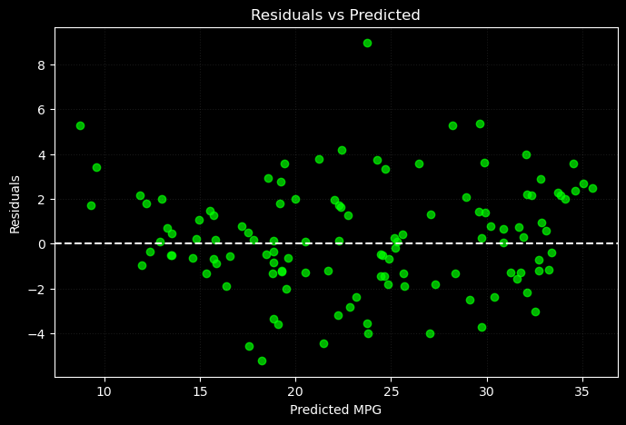
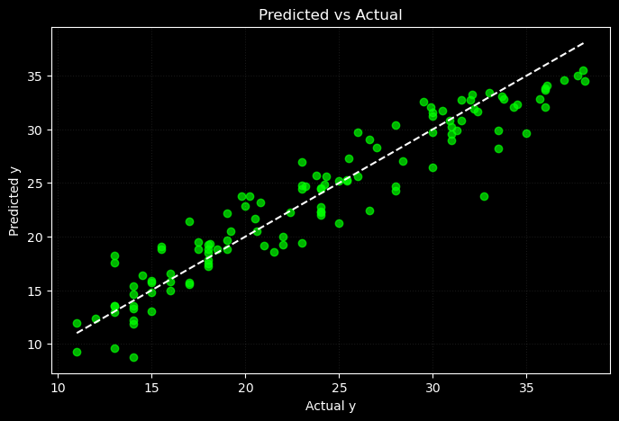

# 📌 ElasticNet Regression from Scratch

This module implements **ElasticNet Regression** from scratch using only NumPy — combining both **L1 (Lasso)** and **L2 (Ridge)** regularization. The ElasticNet algorithm helps balance coefficient shrinkage and sparsity, offering robustness on datasets with multicollinearity or when neither Lasso nor Ridge alone performs optimally.

While the model performs **competitively**, it does **not outperform** traditional linear regression on this dataset and was not deployed for demonstration.

---

## 🌐 Live Demo

> Try the model directly here:  
🔗 [ElasticNet Regression on Hugging Face]

---

## 🧠 Key Features

- ✅ Complete implementation using only **NumPy**
- ✅ Trains ElasticNet using **gradient descent**
- ✅ Combines **L1 and L2** penalties to balance between Lasso and Ridge
- ✅ Evaluated on the Auto-MPG dataset
- ✅ Visualized residuals and prediction quality
- ✅ **Deployed** using Streamlit and Hugging Face 

Note : Even though this model didn’t outperform others, I deployed it to demonstrate how different forms of regularization affect model behavior — both mathematically and practically.

---

## 📁 Directory Structure

ElasticNet/
│
├── Analysis and Visualization/ # Residuals, prediction plots, training curves
│
├── DevSet/ # Early tests on synthetic data
│
├── EDA-&-Preprocessing/ # Cleaned data and preprocessing notebooks
│
├── Implementation/ # Model training and loss calculation
│ └── ElasticNet Model.ipynb
│
├── Results/ # Final evaluation plots
│
└── README.md

---

## 📊 Model Performance Summary

### ✅ Generalization:
- **Test R²**: `0.8997`  
- **Train R²**: `0.8450`  
- The model generalizes well to unseen data.

---

### ✅ Error Metrics:
- **MSE** increased from `5.6752` → `5.6817`  
- This is only a **0.06% increase** in average prediction error (based on RMSE).  
- Both **MSE and MAE** dropped on train/test sets during training, indicating **smooth convergence**.

---

### ✅ R² Score Trends:
- **Train R²**: `0.8451 → 0.8450`  
- **Test R²**: `0.8999 → 0.8997`  
- These minimal changes confirm the model reached a **stable solution** with no meaningful overfitting.

---

## 📈 Evaluation Plots

### 📉 Residuals Plot  
Residuals are randomly scattered around the **y = 0** line, indicating the model's errors have no pattern — a positive sign for model assumptions.

---

### 📊 Actual vs Predicted  
Points lie close to the **diagonal (y = x)** line, showing strong predictive power and alignment between model output and real data.

---

### 📈 Summary:
The ElasticNet implementation performs reliably but does not outperform traditional linear regression or its individual regularized counterparts (Ridge, Lasso) on this dataset.

---

## 📝 Takeaways

- ElasticNet serves as a **hybrid regularization model**, combining benefits of Lasso and Ridge.
- Ideal for datasets with **many features** or **high multicollinearity** — but unnecessary here.
- Deployment was skipped due to **no added benefit** over simpler models.

---

## 📬 Contact

Built by **[FahaDragusss](https://github.com/FahaDragusss)**  
Reach out for discussions, collaborations, or feedback.

---

## 📄 License

This module is licensed under the **MIT License**.
