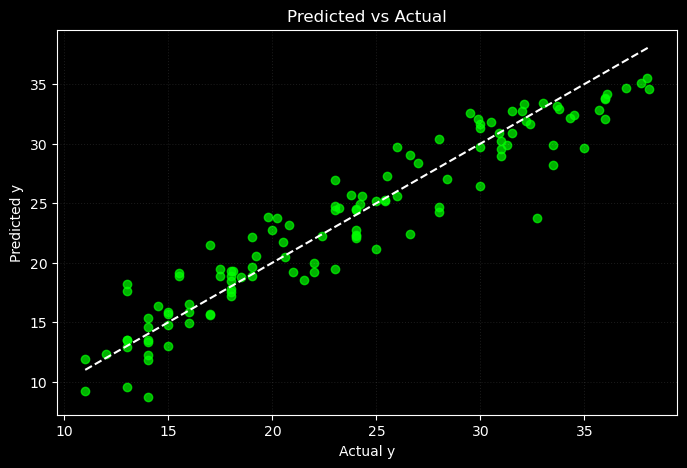

# 📌 Lasso Regression from Scratch (Deployed on Hugging Face)

This module implements **Lasso Regression** from scratch using NumPy, including model training, evaluation, and deployment with a simple Streamlit interface.

Lasso introduces **L1 regularization**, encouraging sparsity in model coefficients — a valuable trait in high-dimensional datasets. While it doesn't outperform the traditional model here, it offers robustness and has been deployed for demonstration.

---

## 🌐 Live Demo

> Try the model directly here:  
🔗 [Lasso Regression on Hugging Face](https://huggingface.co/spaces/FahaDragusss/Lasso-Regression-scratch-streamlit)

---

## 🧠 Key Features

- ✅ Written completely from scratch — no scikit-learn used for training  
- ✅ Implements **L1 regularization** (Lasso)  
- ✅ Trained on cleaned Auto-MPG dataset  
- ✅ **Deployed** using Streamlit and Hugging Face 
- ✅ Fully modular structure for training, evaluation, and visualization  
- ✅ Compared directly with traditional Multiple Linear Regression  

Note : Even though this model didn’t outperform others, I deployed it to demonstrate how different forms of regularization affect model behavior — both mathematically and practically.

---

## 📁 Directory Structure

Lasso/
│
├── Analysis and Visualization/ # Code for all visualizations and GIFs
│
├── app/ # Deployed app (Streamlit interface)
│ ├── app.py
│ ├── model.joblib
│ └── requirements.txt
│
├── Dataset/
│
├── DevSet/ # Early experiments on synthetic data
│
├── EDA-&-Preprocessing/ # Cleaned and processed dataset
│ ├── car-mpg.csv
│ └── EDA & preprocessing.ipynb
│
├── Implementation/ # Training and model evaluation code
│ └── Lasso Model.ipynb
│ 
│
├── Results/ # Final plots
│
└── README.md

---

## 📊 Model Performance Summary

### ✅ Generalization:
- **Test R²**: `0.8998`  
- **Train R²**: `0.8451`  
- Higher test R² suggests strong generalization and no overfitting.

---

### ✅ Error Metrics:
- **MSE increased** slightly from `5.6752` → `5.6786`  
- This is just a **0.02% increase** in average prediction error (based on RMSE).  
- **MAE and MSE** continue to decline during training on both sets, confirming **stable convergence**.

---

### ✅ R² Score Trends:
- **Train R²**: `0.8451 → 0.8451`  
- **Test R²**: `0.8999 → 0.8998`  
- These stable metrics suggest the optimization had already reached an efficient solution.

---

### 📈 Summary:
While the Lasso model **does not outperform** the traditional Multiple Linear Regression model on this dataset, it was successfully implemented and deployed to demonstrate the behavior of **L1 regularization** in action.

---

## 📊 Evaluation Plots

### 📉 Residuals Plot  
The residuals are randomly scattered around the **y = 0** line, showing no visible patterns — a sign of good fit.

---

### 📊 Actual vs Predicted Plot  
Most data points lie near the **y = x** line, meaning predictions closely match actual values.

---

## 📝 Takeaways

- Lasso offers robustness and encourages **sparse feature selection**, useful in complex domains.
- On this dataset, it **does not significantly improve metrics** but maintains stability and generalization.
- Still valuable as a deployed regularized model and a conceptual tool.

---

## 📬 Contact

Built by **[FahaDragusss](https://github.com/FahaDragusss)**  
Reach out for discussions, collaborations, or suggestions.

---

## 📄 License

This module is licensed under the **MIT License**.
