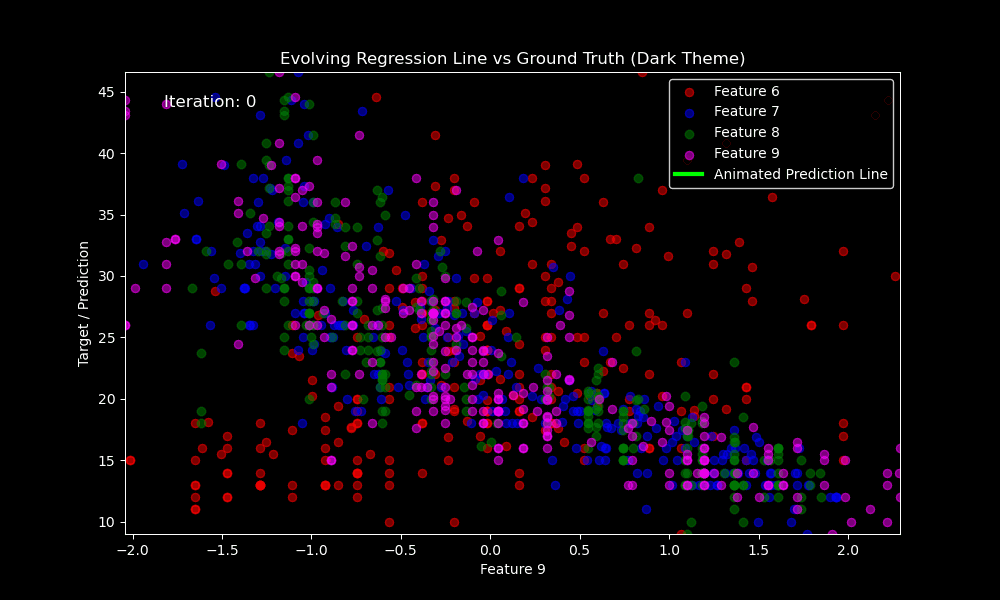
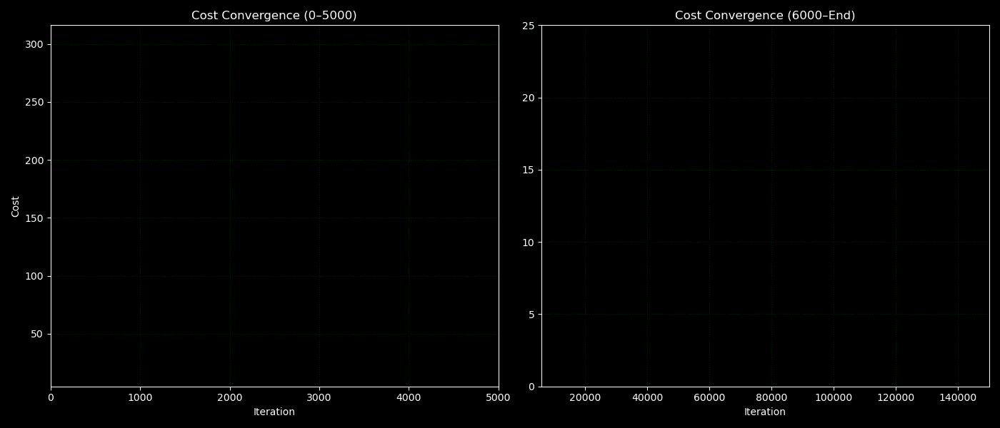
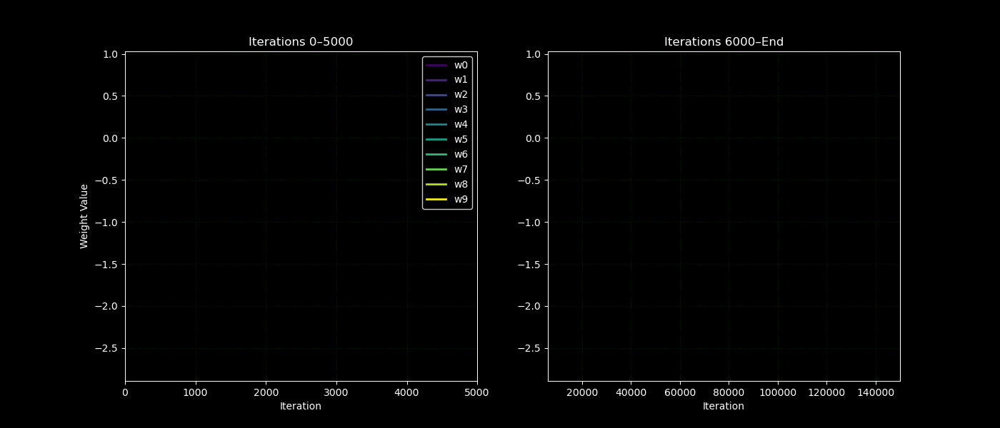
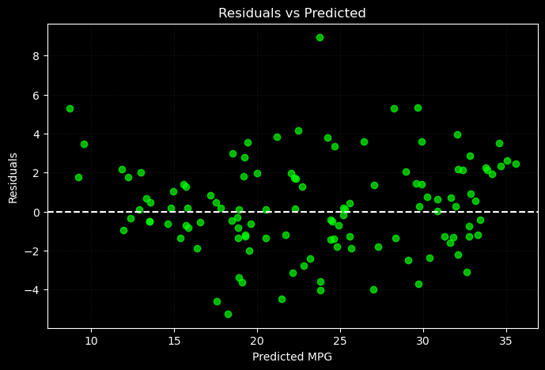
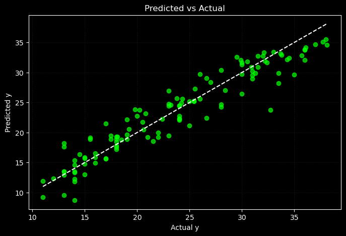

# 📌 Lasso Regression from Scratch (Deployed!)

This project is a subset/small step 1 of implementing Linear Regression, Ridge, Lasso, and ElasticNet from scratch using vectorized NumPy.

It is trained on a real-world dataset and is deployed using Streamlit on Hugging Face Spaces.

---

## 🧠 Key Features
- ✅ Fully vectorized implementations (no scikit-learn for training)
- ✅ End-to-end workflow: from EDA → preprocessing → training → deployment
- ✅ Animated visualizations to show model behavior
- ✅ Deployed interactive app via Streamlit + Hugging Face

---

## 💡 Why Build These From Scratch?

- **Conceptual Depth**: Learn how regression, gradients, and regularization actually work
- **Transparency**: Every equation is visible in code — no black boxes
- **Debugging Practice**: GIFs and cost plots help catch subtle bugs
- **Modularization**: Each part of the ML pipeline is cleanly separated

---

## ⚙️ Techniques Used

- ✅ Vectorized Matrix Operations (NumPy)
- ✅ Batch Gradient Descent
- ✅ Feature Scaling and Outlier Removal
- ✅ Regularization: L1 (Lasso), L2 (Ridge), and ElasticNet
- ✅ Soft Thresholding (for L1 penalty)
- ✅ Visualization of Cost & Parameter Convergence
- ✅ R², MAE, MSE, Residual Plots, Actual vs. Predicted Plots

---

## 🔗 Live Demo Multiple Linear Regression
🎯 **[👉 Try the Streamlit App on Hugging Face](https://huggingface.co/spaces/FahaDragusss/MLR-scratch-streamlit)**

## 🔗 Live Demo Lasso Regression
🎯 **[👉 Try the Streamlit App on Hugging Face](https://huggingface.co/spaces/FahaDragusss/Lasso-Regression-scratch-streamlit)**

---

## 📊 Dataset
- Dataset: [Auto MPG Dataset](https://www.kaggle.com/datasets/yasserh/auto-mpg-dataset)
- Preprocessing:
  - Handled missing values
  - Feature scaling
  - Log transformation (unskewing)
  - Outlier Handling
  - Exploratory Data Analysis (EDA)

---

## 🧪 Project Structure

```
Linear Models/
│
│
├──ElasticNet/
│  │
│  ├── Dataset
│  ├── Implementation/
│  │   ├── MLR L1-L2_reg.ipynb
│  └── README.md
│
│
│
├──Lasso
│  │
│  ├── Analysis and visualization/       # Code used to generate GIFs and plots
│  ├── app/                           # Streamlit interface
│  │   ├── streamlit_app.py
│  │   ├── model.joblib
│  │   └── requirements.txt
│  ├── Dataset 
│  ├── DevSet/                        # Prototype implementation on synthetic data
│  ├── EDA-&-Preprocessing/
│  │   └── EDA & preprocessing.ipynb
│  ├── Implementation/
│  │   ├── MLR Model.ipynb
│  ├── Results/                       # Final visuals for presentation
│  └── README.md
│
│
│
├──Ridge/
│  │
│  ├── Dataset
│  ├── DevSet/                        # Prototype implementation on synthetic data
│  ├── EDA-&-Preprocessing/
│  │   └── EDA & preprocessing.ipynb
│  ├── Implementation/
│  │   ├── MLR L1_reg.ipynb
│  └── README.md
│
│
│
└──Traditional/
   │
   ├── Analysis and visualization/       # Code used to generate GIFs and plots
   ├── app/                           # Streamlit interface
   │   ├── streamlit_app.py
   │   ├── model.joblib
   │   └── requirements.txt
   ├── Dataset 
   ├── DevSet/                        # Prototype implementation on synthetic data
   ├── EDA-&-Preprocessing/
   │   └── EDA & preprocessing.ipynb
   ├── Implementation/
   │   ├── MLR L2_reg.ipynb
   ├── Results/                       # Final visuals for presentation
   └── README.md
```

---

## 🚀 How to Run Locally

```bash
# Step 1: Clone the repo
git clone https://github.com/FahaDragusss/Machine-Learning-Portfolio.git

# Step 2: Navigate to app folder
cd ./app

# Step 3: Install dependencies
pip install -r requirements.txt

# Step 4: Run the Streamlit app
streamlit run app.py
```

---

## 📈 Training Visualizations for Traditional Multiple linear Regression

These project includes animations and plots to visualize the training and convergence behavior of models (Some of them are showcased here): 

---

### 🎞️ Regression Line Fitting Animation
Shows how the model adjusts the regression line over time to minimize cost.



---

### 📉 Cost Function Convergence
Visualizes the descent of the cost function over iterations, confirming successful optimization.

- **Left plot**: Iterations ≤ 5000  
- **Right plot**: Iterations ≥ 6000 up to convergence



---

### 🧠 Weights (Theta) Convergence
Demonstrates how model weights (`θ`) stabilize over training iterations.

- **Left plot**: Iterations ≤ 5000  
- **Right plot**: Iterations ≥ 6000 up to convergence



---

## 🔍 Visualization to evaluate Lasso Regression

---

### 📉 Residuals Plot
This scatter plot displays the residuals (i.e., the differences between actual and predicted values). Ideally, the points should appear randomly dispersed around the horizontal line at y = 0. Such a pattern suggests that the model's errors are randomly distributed — a key indicator of a well-fitted linear model without systematic bias.



---

### 📊 Actual vs Predicted Plot
This plot compares the predicted values against the actual ground-truth values. Ideally, the points should align closely along the diagonal line (y = x), indicating that the model is accurately capturing the relationship in the data. Deviations from this line reflect prediction errors and help identify underfitting or overfitting.



---

## 📚 Learnings & Takeaways
- Gradient descent behaves differently under each regularization type.
- Lasso uses non-differentiable penalties — hence not truly gradient-based due to which softsign was implemented.
- Visualizing training metrics greatly enhances interpretability.

---

## 📬 Contact
Built by **[FahaDragusss](https://github.com/FahaDragusss)**  
Feel free to reach out for collaboration or feedback!

---

## 📄 License
This project is licensed under the MIT License.
