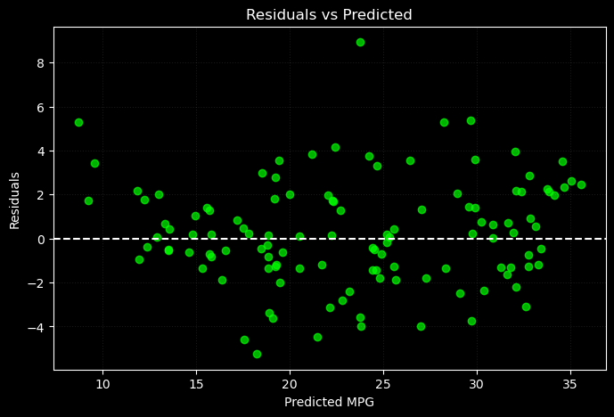
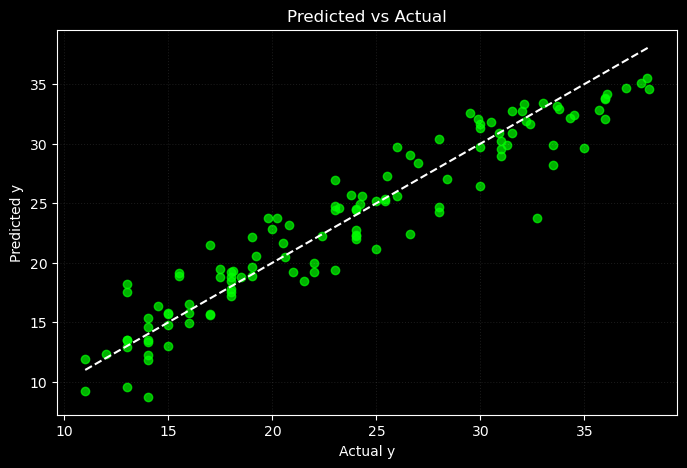

# 📌 Ridge Regression from Scratch (No Deployment)

This module implements **Ridge Regression** from scratch using fully vectorized NumPy, as part of a larger project exploring linear and regularized models.

Unlike the base multiple linear regression model (which was deployed), this Ridge implementation focuses purely on model behavior, convergence, and generalization — **not** deployment or flashy demos.

---

## 🌐 Live Demo

> Try the model directly here:  
🔗 [Ridge Regression on Hugging Face](https://huggingface.co/spaces/FahaDragusss/Ridge-regression-scratch-streamlit)

---

## 🧠 Key Features
- ✅ No scikit-learn training — fully written with NumPy  
- ✅ Applied L2 Regularization (Ridge) to reduce overfitting  
- ✅ Modular pipeline for training, testing, and visualizing  
- ✅ Residual & Prediction plots to assess model fitness
- ✅ **Deployed** using Streamlit and Hugging Face 

Note : Even though this model didn’t outperform others, I deployed it to demonstrate how different forms of regularization affect model behavior — both mathematically and practically.

---

## 📊 Dataset
- Dataset: [Auto MPG Dataset](https://www.kaggle.com/datasets/yasserh/auto-mpg-dataset)
- Preprocessing steps:
  - Outlier removal  
  - Feature scaling  
  - Log transformation on skewed variables  
  - Missing values handled  
  - Categorical encoding  

---

## 🧪 Project Structure

Ridge/
│
├── Dataset/ # Processed data
│
├── DevSet/ # Experiments on synthetic datasets
│
├── EDA & Preprocessing/ # Data preparation and analysis notebooks
│
├── Implementation/ # Final training & model code
│
└── README.md # This file

---

## 📊 Model Performance Summary

### ✅ Generalization:
- **Test R²**: `0.8998`  
- **Train R²**: `0.8450`  

The model generalizes well. The fact that test R² is even slightly higher than train R² implies **strong performance on unseen data** with no signs of overfitting.

---

### ✅ Error Metrics:
- **Train MSE** increased slightly from `5.6752` to `5.6778`  
- That’s only a **0.02% increase in average prediction error**, confirming numerical stability.

Both **MSE** and **MAE** continue to **decline smoothly**, showing no divergence in training.

---

### ✅ R² Score Stability:
- **Train R²**: `0.8451 → 0.8450`  
- **Test R²**: `0.8999 → 0.8998`

No significant R² improvements — the optimization path had already reached a good local minimum.

---

### 📈 Summary:
Although Ridge Regression shows stable behavior and generalization, it **does not outperform** the base multiple linear regression model for this dataset. Therefore, it was **not deployed**.

---

## 📈 Evaluation Plots

### 📉 Residuals Plot  
Residuals are randomly scattered around the **y = 0** line, indicating the model's errors have no pattern — a positive sign for model assumptions.

---

### 📊 Actual vs Predicted  
Points lie close to the **diagonal (y = x)** line, showing strong predictive power and alignment between model output and real data.

---

## 📚 Learnings & Takeaways
- Ridge adds robustness but doesn't guarantee better performance.  
- Even small regularization strengths affect convergence behavior.  
- Model generalization ≠ model superiority — metrics must guide deployment choices.  

---

## 📬 Contact
Built by **[FahaDragusss](https://github.com/FahaDragusss)**  
Feel free to reach out for collaboration or feedback.

---

## 📄 License
This module is licensed under the **MIT License**.

