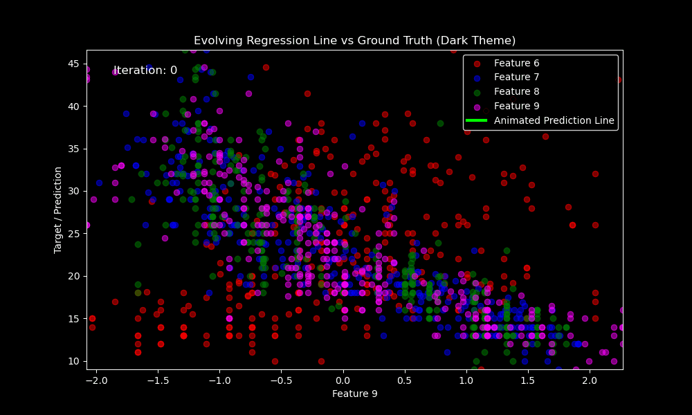
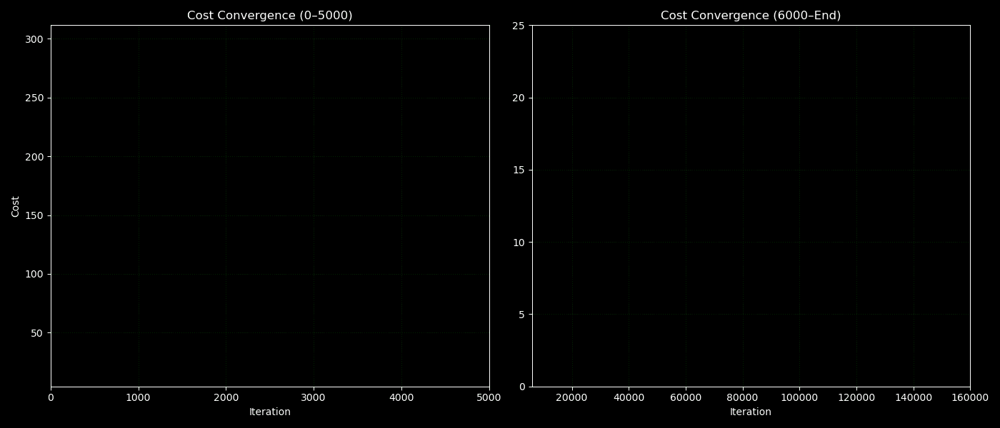
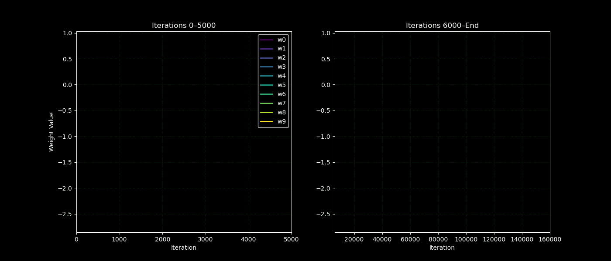

# 📌 Multiple Linear Regression from Scratch (Deployed!)

This project is a subset/small step 1 of implementing Linear Regression, Ridge, Lasso, and ElasticNet from scratch using vectorized NumPy.

It is trained on a real-world dataset and is deployed using Streamlit on Hugging Face Spaces.

---

## 🧠 Key Features
- ✅ Fully vectorized implementations (no scikit-learn for training)
- ✅ End-to-end workflow: from EDA → preprocessing → training → deployment
- ✅ Animated visualizations to show model behavior
- ✅ Deployed interactive app via Streamlit + Hugging Face

---

## 🔗 Live Demo
🎯 **[👉 Try the Streamlit App on Hugging Face](https://huggingface.co/spaces/FahaDragusss/MLR-scratch-streamlit)**

---

## 📊 Dataset
- Dataset: [Auto MPG Dataset](https://www.kaggle.com/datasets/yasserh/auto-mpg-dataset)
- Preprocessing:
  - Handled missing values
  - Feature scaling
  - Log transformation (unskewing)
  - Outlier Handling
  - Exploratory Data Analysis (EDA)

---

## 🧪 Project Structure

```
project/
│
├── Analysis and visualization/    # Generated GIFs and plots
├── app/                           # Streamlit interface
│   ├── app.py
│   ├── model.joblib
│   └── requirements.txt
├── DevSet/                        # Prototype implementation on synthetic data
├── EDA-&-Preprocessing/
│   ├── car-mpg.csv
│   └── EDA & preprocessing.ipynb
├── Implementation/
│   ├── MLR Model.ipynb
│   └── handled-car-mpg.csv
├── Results/                       # Final visuals for presentation
└── README.md
```

---

## 🚀 How to Run Locally

```bash
# Step 1: Clone the repo
git clone https://github.com/FahaDragusss/Machine-Learning-Portfolio.git

# Step 2: Navigate to app folder
cd Machine-Learning-Portfolio/Linear Regression Models from Scratch Deployment/Multiple Linear Regression/app

# Step 3: Install dependencies
pip install -r requirements.txt

# Step 4: Run the Streamlit app
streamlit run app.py
```

---

## 📈 Training Visualizations

This project includes animations and plots to visualize the training and convergence behavior of models:

---

### 🎞️ Regression Line Fitting Animation
Shows how the model adjusts the regression line over time to minimize cost.



---

### 📉 Cost Function Convergence
Visualizes the descent of the cost function over iterations, confirming successful optimization.

- **Left plot**: Iterations ≤ 5000  
- **Right plot**: Iterations ≥ 6000 up to convergence



---

### 🧠 Weights (Theta) Convergence
Demonstrates how model weights (`θ`) stabilize over training iterations.

- **Left plot**: Iterations ≤ 5000  
- **Right plot**: Iterations ≥ 6000 up to convergence



---

## 📚 Learnings & Takeaways
- Gradient descent behaves differently under each regularization type.
- Lasso uses non-differentiable penalties — hence not truly gradient-based.
- Visualizing training metrics greatly enhances interpretability.

---

## 📬 Contact
Built by **[FahaDragusss](https://github.com/FahaDragusss)**  
Feel free to reach out for collaboration or feedback!

---

## 📄 License
This project is licensed under the MIT License.
