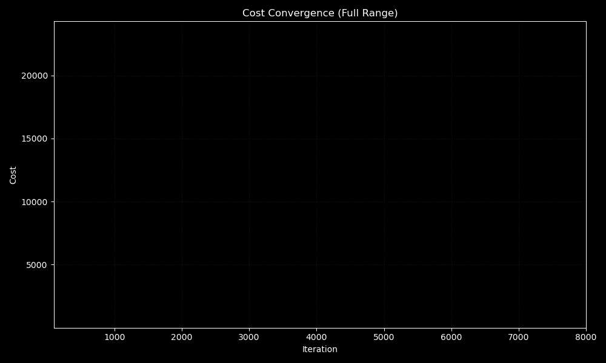

# 📌Polynomial ElasticNet Regression from Scratch

This module implements **Polynomial ElasticNet Regression** from scratch using only NumPy — combining both **L1 (Lasso)** and **L2 (Ridge)** regularization. The ElasticNet algorithm helps balance coefficient shrinkage and sparsity, offering robustness on datasets with multicollinearity or when neither Lasso nor Ridge alone performs optimally.

While the model performs **competitively**, it does **not outperform**  lasso regression on this dataset and was only deployed to showcase the ability to implement such model from scratch.

Moreover, the **adam optimizer** used was also implemented by me. Only Numpy was used for the implementation.

---

## 🌐 Live Demo

> Try the model directly here:  
🔗 [ElasticNet Regression on Hugging Face](https://huggingface.co/spaces/FahaDragusss/Poly-elasticnet-regression-scratch-streamlit)

---

## 🧠 Key Features

- ✅ Complete implementation using only **NumPy**
- ✅ Trains ElasticNet using **gradient descent** optimized with **adam optimizer**
- ✅ Combines **L1 and L2** penalties to balance between Lasso and Ridge
- ✅ Evaluated on the CO2 Emmisions dataset
- ✅ Visualized residuals and prediction quality
- ✅ **Deployed** using Streamlit and Hugging Face 

Note : Even though this model didn’t outperform others, I deployed it to demonstrate how different forms of regularization affect model behavior — both mathematically and practically.

---

## 📁 Directory Structure

ElasticNet/
│
├── Analysis and Visualization/ # Notebook to create animations
│
├── app/ # Deployed app (Streamlit interface)
│ ├── app.py
│ ├── model.joblib
│ └── requirements.txt
│ 
├── Dataset/ # Subset of the complete data used
│
├── Implementation/ # Model training and Implementation
│ └── Polynomial ElasticNet Model.ipynb
│
├── Results/ # Final evaluation plots
│
└── README.md

---

## 📊 Model Performance Summary

### ✅ Generalization:
- **Test R²**: `0.9984`  
- **Train R²**: `0.9984`  
- The model generalizes well to unseen data.

---

### ✅ Error Metrics:
- **MSE** is also practically the same (5.2493) for Test and (5.2696) for the Train. 
- Both **MSE and MAE** dropped on train/test sets during training, indicating **smooth convergence**.

---

## 📈 Evaluation and Visualization Plots

### 📉 Cost convergence
A Cost convergence plot shows how the cost decreases as the model learns after each iteration.

---

### 📊 Actual vs Predicted  
Points lie close to the **diagonal (y = x)** line, showing strong predictive power and alignment between model output and real data.

---

### 📈 Summary:
The ElasticNet implementation performs reliably well.

---

## 📝 Takeaways

- ElasticNet serves as a **hybrid regularization model**, combining benefits of Lasso and Ridge.
- Ideal for datasets with **many features** or **high multicollinearity**.

---

## 📬 Contact

Built by **[FahaDragusss](https://github.com/FahaDragusss)**  
Reach out for discussions, collaborations, or feedback.

---

## 📄 License

This module is licensed under the **MIT License**.
