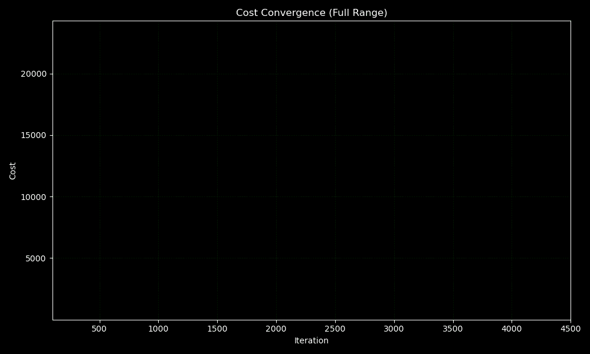
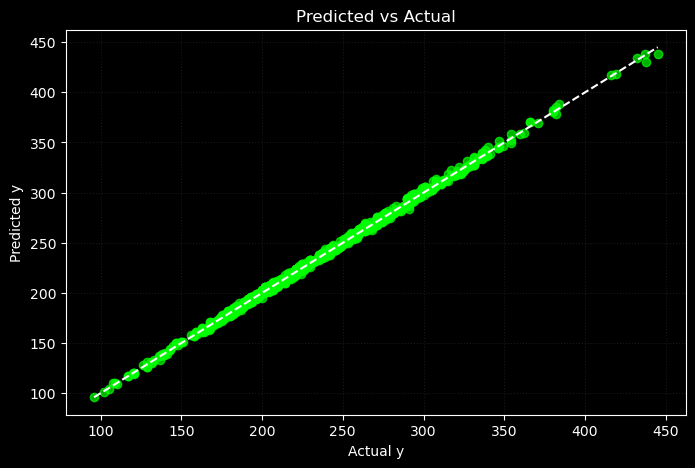

# 📌 Polynomial Lasso Regression from Scratch (Deployed on Hugging Face)

This module implements **Lasso Regression** from scratch using NumPy, including model training, evaluation, and deployment with a simple Streamlit interface.

Lasso introduces **L1 regularization**, encouraging sparsity in model coefficients — a valuable trait in high-dimensional datasets.

Moreover, the **adam optimizer** used was also implemented by me. Only Numpy was used for the implementation.

---

## 🌐 Live Demo

> Try the model directly here:  
🔗 [Lasso Regression on Hugging Face](https://huggingface.co/spaces/FahaDragusss/Poly-lasso-regression-scratch-streamlit)

---

## 🧠 Key Features

- ✅ Written completely from scratch — no scikit-learn used for training  
- ✅ Trained using **Batch Gradient descent** and **Adam optimizer** both implemented from scratch
- ✅ Implements **L1 regularization** (Lasso)  
- ✅ Trained on cleaned subset of Vehicle CO2 Emmision dataset 
- ✅ **Deployed** using Streamlit and Hugging Face 
- ✅ Fully modular structure for training, evaluation, and visualization  
- ✅ Compared directly with traditional Multiple Linear Regression  

Note : Even though this model didn’t outperform others, I deployed it to demonstrate how different forms of regularization affect model behavior — both mathematically and practically.

---

## 📁 Directory Structure

Lasso/
│
├── Analysis and Visualization/ # Code for all visualizations and GIFs
│
├── app/ # Deployed app (Streamlit interface)
│ ├── app.py
│ ├── model.joblib
│ └── requirements.txt
│
├── Dataset/ # Subset of the main dataset.
│
├── Implementation/ # Training and model evaluation code
│ └── Polynomial Lasso Model.ipynb
│
├── Results/ # Final plots
│
└── README.md

---

## 📊 Model Performance Summary

### ✅ Generalization:
- **Test R²**: `0.9984`  
- **Train R²**: `0.9984`  
- Same R² suggests strong generalization and no overfitting.

---

### ✅ Error Metrics:
- **MSE** is also practically the same (5.2440) for Test and (5.2694) for the Train.  
- **MAE and MSE** continue to decline during training on both sets, confirming **stable convergence**.

---

### 📈 Summary:
The **lasso** Model performed very well, it was successfully implemented and deployed to demonstrate the behavior of **L1 regularization** in action.

---

## 📊 Evaluation Plots

### 📉  Cost Convergence animation  
We can see how after each iteration the model cost decreases. and converges.

---

### 📊 Actual vs Predicted Plot  
Most data points lie near the **y = x** line, meaning predictions closely match actual values.

---

## 📝 Takeaways

- Lasso offers robustness and encourages **sparse feature selection**, useful in complex domains.
- On this dataset, it **does significantly improve metrics** and maintains stability and generalization.
- Model deployed.

---

## 📬 Contact

Built by **[FahaDragusss](https://github.com/FahaDragusss)**  
Reach out for discussions, collaborations, or suggestions.

---

## 📄 License

This module is licensed under the **MIT License**.
