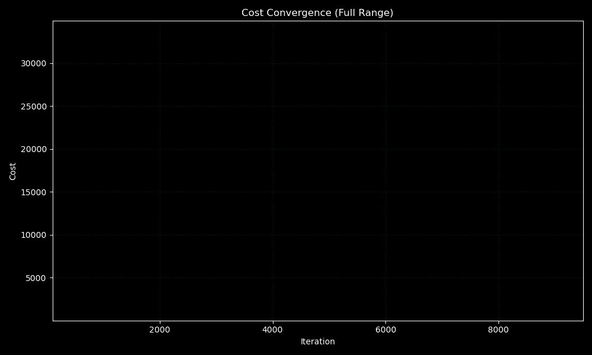
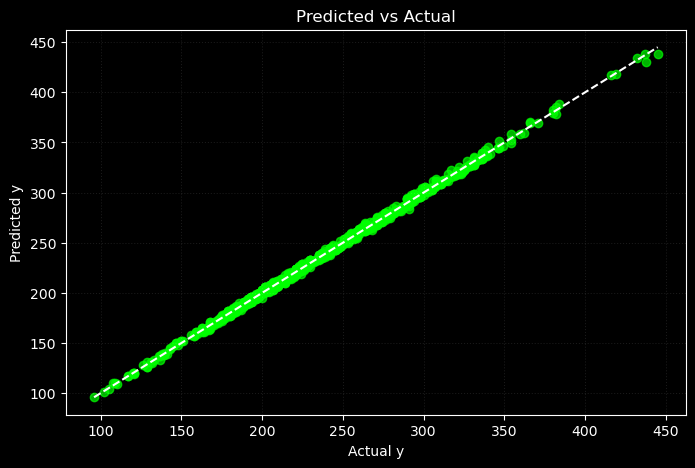

# 📌 Polynomial Regression models from Scratch (Deployed!)

This project is a subset/small step 2 of implementing Linear and Logistic Regression, Ridge, Lasso, and ElasticNet from scratch using vectorized NumPy. In step 2 we move towards Implementing Linear Regression with non linear Features aka Polynomial Regression, Ridge, Lasso and ElasticNet from scratch using vectorized Numpy.

It is trained on a real-world dataset and is deployed using Streamlit on Hugging Face Spaces.

---

## 🧠 Key Features
- ✅ Fully vectorized implementations (no scikit-learn for training)
- ✅ End-to-end workflow: from EDA → preprocessing → training → deployment
- ✅ Animated visualizations to show model behavior
- ✅ Deployed interactive app via Streamlit + Hugging Face

---

## 💡 Why Build These From Scratch?

- **Conceptual Depth**: Learn how regression, gradients, optimizers/optimization, and regularization actually work
- **Transparency**: Every equation is visible in code — no black boxes
- **Debugging Practice**: GIFs and cost plots help catch subtle bugs
- **Modularization**: Each part of the ML pipeline is cleanly separated

---

## ⚙️ Techniques Used

- ✅ Vectorized Matrix Operations (NumPy)
- ✅ Batch Gradient Descent
- ✅ Optimizers (Adam optimizer, RMSprop and BGD with Momentum)
- ✅ Feature Scaling and Outlier Removal
- ✅ Converting Features to Polynomial features
- ✅ Created a funtion to convert features to Polynomials from scratch
- ✅ Regularization: L1 (Lasso), L2 (Ridge), and ElasticNet
- ✅ Soft Thresholding (for L1 penalty)
- ✅ Visualization of Cost & Parameter Convergence
- ✅ R², MAE, MSE, Residual Plots, Actual vs. Predicted Plots

---

## 🔗 Live Demo Polynomial Regression
🎯 **[👉 Try the Streamlit App on Hugging Face](https://huggingface.co/spaces/FahaDragusss/Poly-regression-scratch-streamlit)**

## 🔗 Live Demo Polynomial Ridge Regression
🎯 **[👉 Try the Streamlit App on Hugging Face](https://huggingface.co/spaces/FahaDragusss/Poly-lasso-regression-scratch-streamlit)**

## 🔗 Live Demo Polynomial Lasso Regression
🎯 **[👉 Try the Streamlit App on Hugging Face](https://huggingface.co/spaces/FahaDragusss/Poly-ridge-regression-scratch-streamlit)**

## 🔗 Live Demo Polynomial ElasticNet Regression
🎯 **[👉 Try the Streamlit App on Hugging Face](https://huggingface.co/spaces/FahaDragusss/Poly-elasticnet-regression-scratch-streamlit)**

---

## 📊 Dataset
- Dataset: [Vehicle CO2 Emmision Dataset](https://www.kaggle.com/datasets/brsahan/vehicle-co2-emissions-dataset)
- Preprocessing:
  - Handled missing values
  - Feature scaling
  - Log transformation (unskewing)
  - Outlier Handling
  - Exploratory Data Analysis (EDA)

---

## 🧪 Project Structure

```
Polynomial Models/
│
│
├──ElasticNet/ # Similar to traditional
│
├──Lasso/ # Similar to traditional
│
├──Ridge/ # Similar to traditional
│
├──Preprocessing/
│  │ 
│  ├──co2.csv # Main dataset
│  │ 
│  ├──Fuel-type-E.csv # Subset of main dataset
│  ├──Fuel-type-D.csv # Subset of main dataset
│  ├──Fuel-type-X.csv # Subset of main dataset
│  ├──Fuel-type-Z.csv # Subset of main dataset
│  ├──PER X.ipynb # notebook modeling and test scikit learn models.
│  ├──PRR D.ipynb # notebook modeling and test scikit learn models.
│  ├──PRR E.ipynb # notebook modeling and test scikit learn models.
│  └──PRR Z.ipynb # notebook modeling and test scikit learn models.
│ 
└──Traditional/
   │
   ├── Analysis and visualization/       # Code used to generate GIFs and plots
   ├── app/                           # Streamlit interface
   │   ├── streamlit_app.py
   │   ├── model.joblib
   │   └── requirements.txt
   ├── Dataset 
   ├── DevSet/                        # Prototype implementation on synthetic data
   ├── Implementation/
   │   ├── Polynomial Regression.ipynb
   ├── Results/                       # Final visuals for presentation
   └── README.md
```

---

## 🚀 How to Run Locally

```bash
# Step 1: Clone the repo
git clone https://github.com/FahaDragusss/Machine-Learning-Portfolio.git

# Step 2: Navigate to app folder
cd ./app

# Step 3: Install dependencies
pip install -r requirements.txt

# Step 4: Run the Streamlit app
streamlit run app.py
```

---

## 📈 Training Visualizations for Traditional Multiple linear Regression

These project includes animations and plots to visualize the training and convergence behavior of models (Some of them are showcased here): 

---

### 📉 Cost Function Convergence
Visualizes the descent of the cost function over iterations, confirming successful optimization.



---

## 🔍 Visualization to evaluate Lasso Regression

---

### 📊 Actual vs Predicted Plot
This plot compares the predicted values against the actual ground-truth values. Ideally, the points should align closely along the diagonal line (y = x), indicating that the model is accurately capturing the relationship in the data. Deviations from this line reflect prediction errors and help identify underfitting or overfitting.



---

## 📚 Learnings & Takeaways
- Gradient descent behaves differently under each regularization type.
- Gradient descent with Adam optimizer saves so much time. In my case with adam my model converged in one of the examples in 8000 iterations and without it took more that 100000 iterations.
- Lasso uses non-differentiable penalties — hence not truly gradient-based due to which softsign was implemented.
- Visualizing training metrics greatly enhances interpretability.

---

## 📬 Contact
Built by **[FahaDragusss](https://github.com/FahaDragusss)**  
Feel free to reach out for collaboration or feedback!

---

## 📄 License
This project is licensed under the MIT License.
