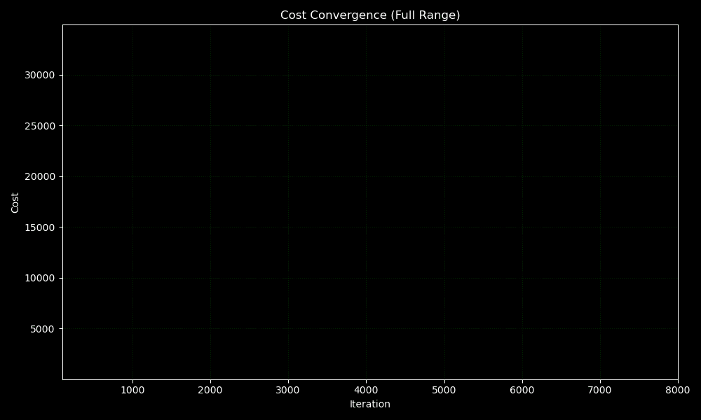
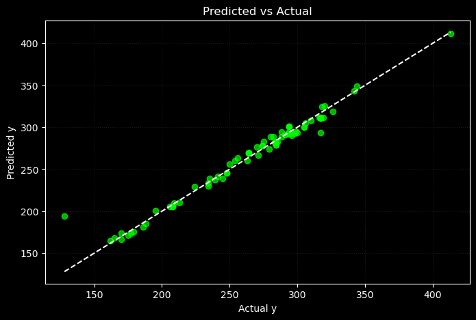

# 📌 Polynomial Regression from Scratch (Deployed on Hugging Face)

This module implements **Polynomial Regression** from scratch using NumPy, including model training, evaluation, and deployment with a simple Streamlit interface.

Features were converted to polynomial via a funtion implemented under the name **'polynomial_features'** due to this the run time significantly increased as after converting features to a **degree 5** polynomial the features which were already around 12 grew to more than a 1000 due to interaction terms. Due to which the need for optimization arised and which propelled me to learn Optimization. After learning **RMSprop**, **BGD with Momentum** and **Adam**. I decided to implement **adam optimizer** from scratch.

---

## 🌐 Live Demo

> Try the model directly here:  
🔗 [Lasso Regression on Hugging Face](https://huggingface.co/spaces/FahaDragusss/Poly-regression-scratch-streamlit)

---

## 🧠 Key Features

- ✅ Written completely from scratch — no scikit-learn used for training  
- ✅ Trained using **Batch Gradient descent** and **Adam optimizer** both implemented from scratch
- ✅ Trained on cleaned subset of Vehicle CO2 Emmision dataset 
- ✅ **Deployed** using Streamlit and Hugging Face 
- ✅ Fully modular structure for training, evaluation, and visualization  
- ✅ Compared directly with traditional Polynomial Ridge Regression  

Note : Even though this model didn’t outperform others, I deployed it to demonstrate how different forms of regularization affect model behavior — both mathematically and practically.

---

## 📁 Directory Structure

Tradition/
│
├── Analysis and Visualization/ # Code for all visualizations and GIFs
│
├── app/ # Deployed app (Streamlit interface)
│ ├── app.py
│ ├── model.joblib
│ └── requirements.txt
│
├── Dataset/ # Subset of the main dataset.
│
├── Implementation/ # Training and model evaluation code
│ └── Polynomial Regression.ipynb
│
├── Results/ # Final plots and .nyp files for model parameters.
│
└── README.md

---

## 📊 Model Performance Summary

### ✅ Generalization:
- **Test R²**: `0.9677`  
- **Train R²**: `0.9894`  
- Similar R² suggests strong generalization and no overfitting.

---

### ✅ Error Metrics:
- MSE Test (87.8934) vs MSE Train (21.6996) — MSE on test is high perhaps due to the Outlier seen in residual scatter plot. MSE is prone to Outliers. On the other hand MAE:
- MAE Test (5.1873) vs MAE Train (4.0101) — MAE on Test is marginally higher.
- **MAE and MSE** continue to decline during training on both sets, confirming **stable convergence**.

---

### 📈 Summary:
The **Polynomial Regression** implemented with the implementation from scratch of the **Adam optimizer** now deployed!

---

## 📊 Evaluation Plots

### 📉  Cost Convergence animation  
We can see how after each iteration the model cost decreases. and converges.

---

### 📊 Actual vs Predicted Plot  
Most data points lie near the **y = x** line, meaning predictions closely match actual values.

---

## 📚 Learnings & Takeaways
- Funtion to convert features to a **degree 'x'** function implemented.
- **Adam optimizer**, **RMSprop**, **BGD with momentum** Learnt.
- **Adam optimizer** implemented from scratch.  
- Model generalization ≠ model superiority — metrics must guide deployment choices.  
- Model deployed.

---

## 📬 Contact

Built by **[FahaDragusss](https://github.com/FahaDragusss)**  
Reach out for discussions, collaborations, or suggestions.

---

## 📄 License

This module is licensed under the **MIT License**.
